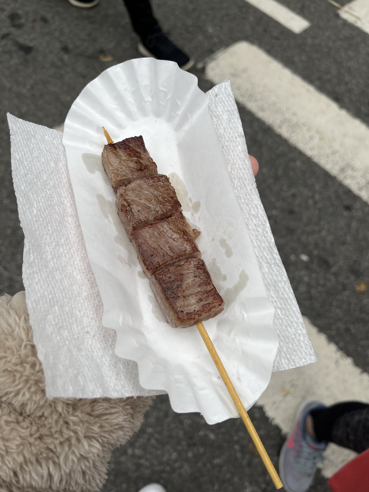
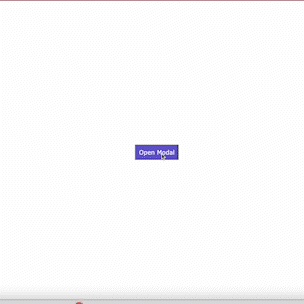
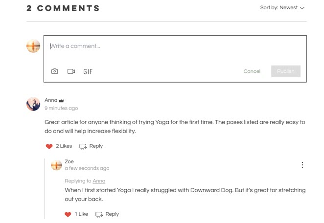

# Midterm Project

For my midterm project, I created a blog-and-review-like website about my experience at an food festival -- JAPAN Fes New York.

This website contains commentary posts about my general experience, a review page for the foods that I tried, and a gallery page with a bunch of photos from the festival.

## Demo of Site
https://docs.google.com/presentation/d/1dQAPJGP6GSdlfUcinmFlyv77y9C5WJ0X1QeB8zEMYVA/edit?usp=sharing

## Snippet of Code

This is a snippet of code of getting the star icon in my review page. I found a tutorial of this from W3Schools.

```html
<head>
  ...
  <link
    rel="stylesheet"
    href="https://cdnjs.cloudflare.com/ajax/libs/font-awesome/4.7.0/css/font-awesome.min.css"
  />
</head>
```
<sub>Link the Font Awesome Icon Library on your head tag</sub>

```html
<div class="review">
  
  <div class="stars">
    <span class="fa fa-star checked"></span>
    <span class="fa fa-star checked"></span>
    <span class="fa fa-star checked"></span>
    <span class="fa fa-star"></span>
    <span class="fa fa-star"></span>
    ...
  </div>
</div>
```
<sub>Use class="fa fa-star" to get the star icon</sub>

```css
.checked {
  color: orange;
}

.stars span {
  font-size: 2em;
}
```
<sub>Can style your star icons in your stylesheet</sub>

## Next Steps
If I had more time or maybe in the future, I think it would be cool to have this interactive feature in the gallery page of when you click on a photo, it will pop up at you -- similar to what we did with modals in class.



Also, maybe have some kind of user-generated content -- allowing other users to leave comments in the website.

