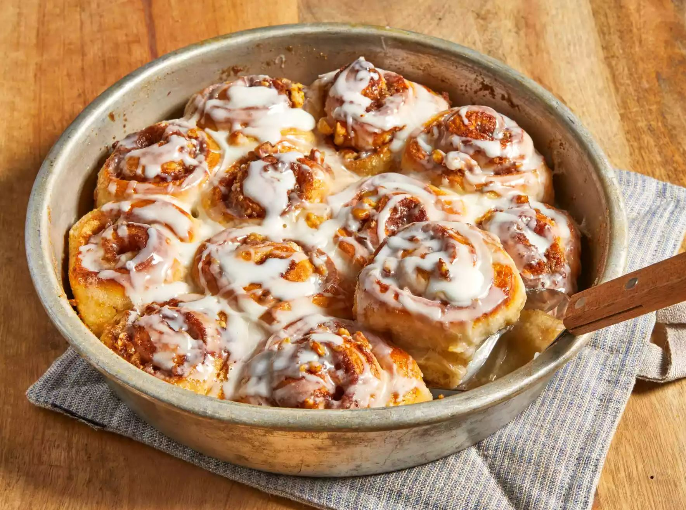

# Recipe for Cinnamon Rolls

Cinnamon rolls are a beloved classic pastry. We will be using prepared bread dough to make these easy and simple treats.
## Ingredients
- 1 (1 pound) loaf frozen bread dough, thawed
- 3 tablespoons butter, melted
- 2/3 cup brown sugar
- 1/2 cup chopped walnuts
- 1 teaspoon ground cinnamon
- 1 teaspoon water, or as needed
- 1/3 cup heavy whipping cream
- 2/3 cup sifted confectioners' sugar
- 2 tablespoons milk
- 1 dash vanilla extract

## Instructions
1. Gather all ingredients and lightly grease 2 round cake pans with butter.
2. Roll bread dough out to an 6x18-inch rectangle. Brush with melted butter.
3. Combine brown sugar, walnuts, and cinnamon in a small bowl; sprinkle over butter.
4. Roll dough into a log, starting at the long edge. Moisten edge with water and seal.
5. Cut log into 20 slices; arrange rolls, cut sides down, in prepared cake pans. Cover with a towel and let rise in a warm place until doubled in volume, about 90 minutes.
6. Preheat oven to 350 degrees F (175 degrees C). Pour heavy cream over dough.
7. Bake in preheated oven until golden brown, about 25 minutes.
8. Mix confectioners' sugar, milk, and vanilla extract in a small bowl; drizzle over warm cinnamon rolls to serve.