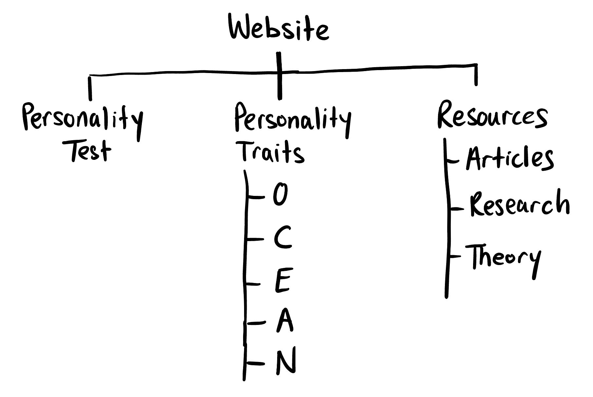
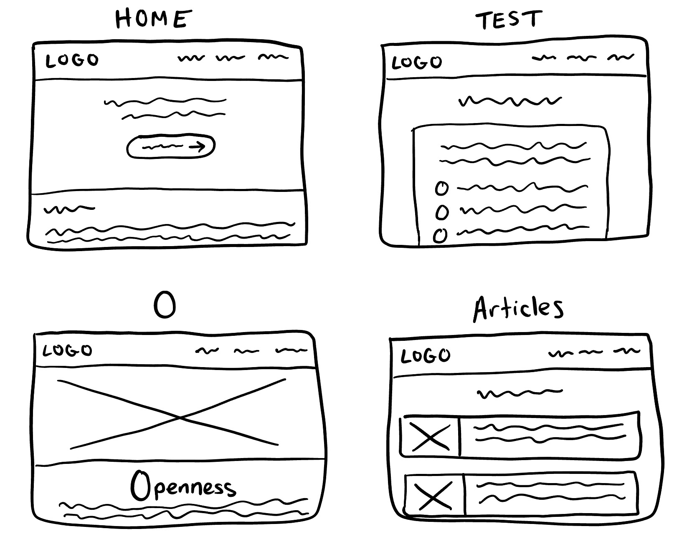
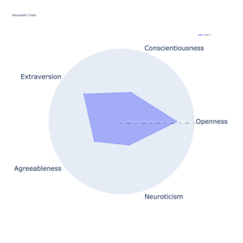

# Final Project Proposal

## Concept Theme
I plan on creating a personality test website that focuses on the Five Factor Model.
The user will complete a set of questionnaires and, at the end, will be given back the result based on the score that was calculated.

## Site Map

## Wireframes

## Inspiration
https://www.16personalities.com/

## To Do List
- Use HTML & CSS to create the structure and format of the website
- Use Javascript to track of the points for each user's response
- Use Javascript to calculate the score result
- Find articles and research papers for the Resources page
- Add automatic graph feature (radar chart)

