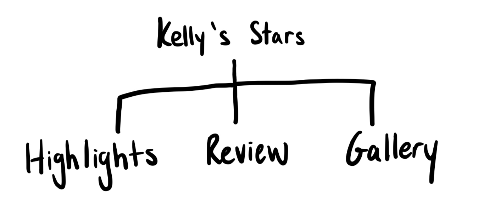
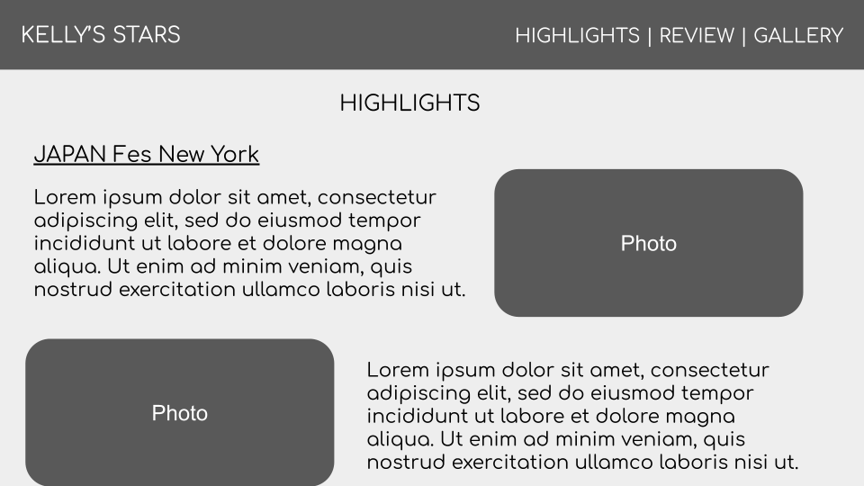
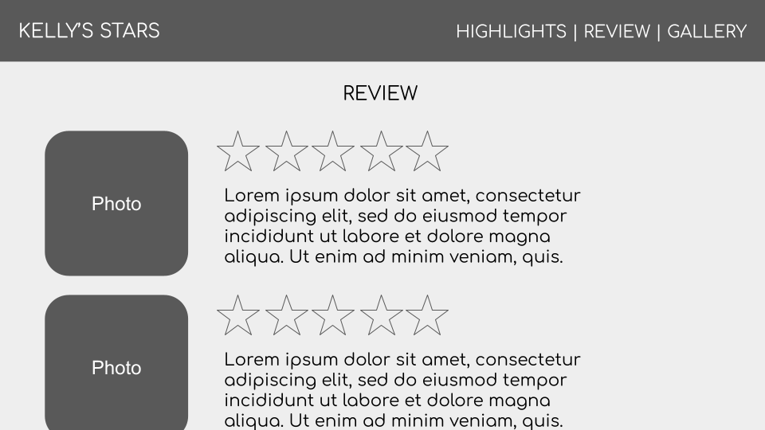
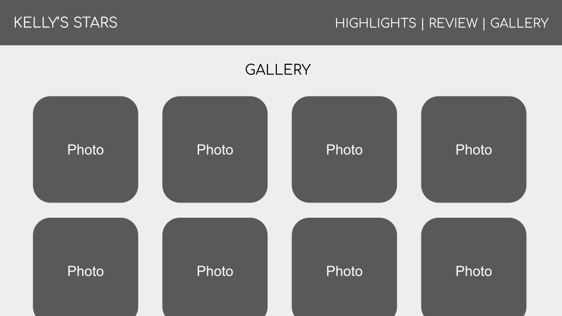

# Midterm Project Proposal

## Concept Theme
    I plan on creating a blog-and-review-like website about my experience at an upcoming food festival -- JAPAN Fes New York.

    I will have some commentary posts about this excursion.
    A review page with my star ratings of some of the foods.
    As well as lots of photos of the food there! ☜(ﾟヮﾟ☜)

## Site Map

## Wireframes
### Highlights

### Review

### Gallery

## Inspiration
https://thefrugalfoodies.com/a-day-at-japan-fes/

## Concept Skills
    Skills covered that I will use to build my site:
    - Navbar
    - Gallery
    - Google Fonts
    - Background image
    - Linking to different pages
    - Flexbox

    Skills I need to still learn to complete the project:
    - Slideshow of images
    - Icons (stars)